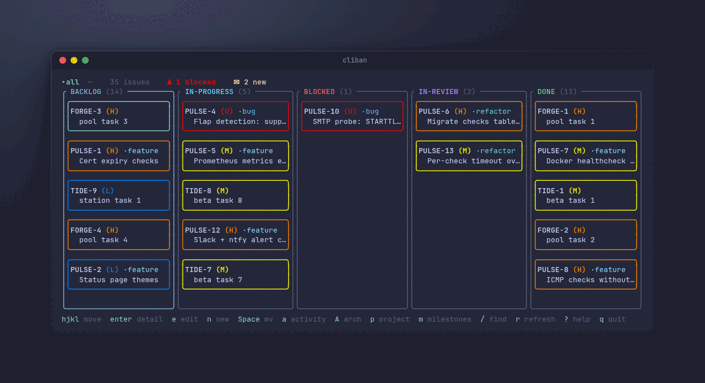
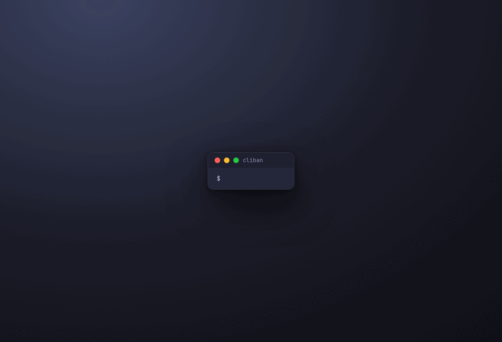
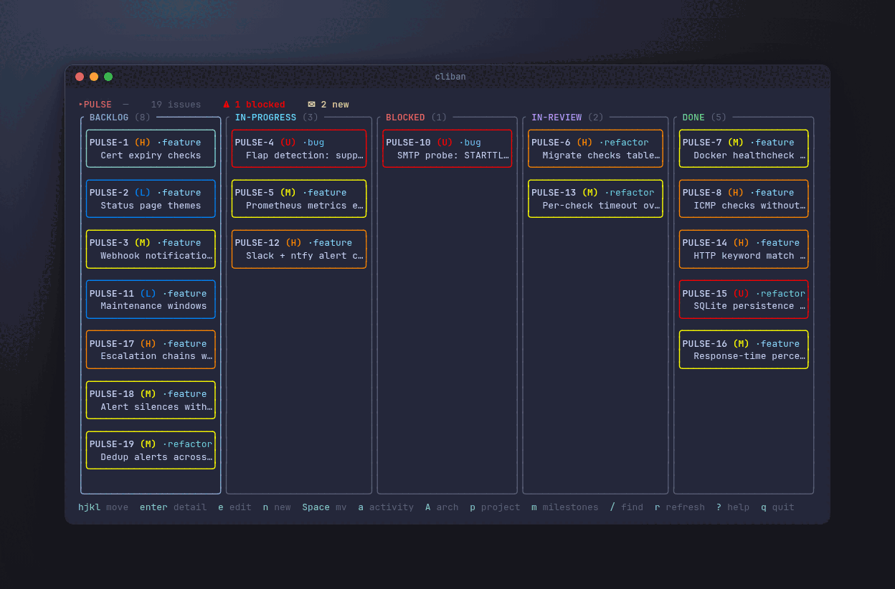

<p align="center">
  <picture>
    <source media="(prefers-color-scheme: dark)" srcset="assets/readme/logo-dark.svg">
    
  </picture>
</p>

<p align="center"><b>The board your agents can't forget.</b></p>

<p align="center">
  <a href="https://github.com/LioraLabs/cliban/actions/workflows/ci.yml"></a>
  <a href="https://github.com/LioraLabs/cliban/releases/latest"></a>
  <a href="https://crates.io/crates/cliban"></a>
  <a href="LICENSE"></a>
</p>

<p align="center"></p>

Your agent wrote a five-task plan, finished two tasks, compacted its context,
and greeted the next session with a cheerful blank stare? cliban is a
self-hosted kanban board built for exactly that agent — and for the fleet of
them you'll run next. The spec and the plan live in the issue, steps get
ticked as they land, every mutation is recorded on a timeline and attributed
to the session that made it, and durable lessons persist as searchable
project memory. All of it sits in SQLite behind atomic CLI commands, so the
plan outlives the context window that wrote it.

```console
$ cliban issue cat PROJ-42 --section plan   # two steps ticked, three to go
$ # ...session crashes, /clear, compaction, lunch...
$ cliban issue current --json                # which issue is this branch again?
$ cliban activity --since 1d                 # what happened while nobody was looking
$ cliban issue tick PROJ-42 --task 2 --step 1   # and back to work
```

<p align="center"></p>
<p align="center"><sub>one lap: scope a project · move a card · milestone progress · the attributed timeline</sub></p>

One board, three front doors:

- **A flat CLI** built for agents: every read has a `--json` form, no command
  opens an editor unless asked, and mutations are atomic and safe to run
  unattended.
- **A ratatui TUI** for you: priority-colored cards over five columns
  (`backlog / in-progress / blocked / in-review / done`).
- **`cliband`** for your team: an SSH daemon serving the same live board to
  everyone. `ssh boards.example.com` and you're in. SSH keys are the auth,
  one SQLite database per tenant is the isolation. See
  [Hosting shared boards](#hosting-shared-boards-over-ssh-cliband).

Heard enough?

```sh
curl -fsSL https://raw.githubusercontent.com/LioraLabs/cliban/main/install.sh | sh
```

That fetches the prebuilt binaries for your platform, verifies them against the
release checksums, and installs `cliban` and `cliband` into `~/.local/bin`. Or
pick your own poison:

```sh
brew install lioralabs/tap/cliban   # macOS and Linux, both binaries
cargo binstall cliban               # prebuilt, no compile
cargo install cliban                # from source
```

The cargo lines install the `cliban` CLI alone; the daemon is a second crate,
`cargo install cliban-server`. Every other route ships both. Prebuilt archives
and `SHA256SUMS` are on the
[releases page](https://github.com/LioraLabs/cliban/releases); an AUR
`PKGBUILD` lives in [`packaging/aur`](packaging/aur).

Then:

```bash
cliban project add PROJ "My project"
cliban issue add "First issue" --project PROJ --priority high
cliban             # opens the TUI
```

## Why not ___?

**A markdown plan file?** Writing the plan to disk is the right instinct,
and it's how most agent-planning setups work: a `task_plan.md` and a
`progress.md`, re-read every turn. But a loose file has no structure a tool
can enforce. The agent can clobber the plan wholesale, two agents corrupt it
in parallel, and "how far did we get" is a diff, not a query. cliban makes
the plan a contract: tickable steps mutated through `tick`, `log`, and
`promote`, each one a single SQL transaction, each one refused loudly (exit
code 2) when the structure is violated. Nothing is ever deleted, archiving
is reversible, and the history survives every rewrite.

**Jira, Linear, GitHub Issues?** Built for humans clicking. Agents drive
them through rate-limited APIs with auth tokens, and your plans live on
someone else's server. cliban is a local SQLite file with a flat CLI:
nothing leaves your machine unless you run `cliband`, and then it goes only
where your SSH keys say. That said, when the team's source of truth is
Linear anyway, cliban can borrow an issue and report back beautifully — see
[Linear](#linear) below.

**Your agent's own memory?** That's the thing that keeps getting compacted.

## Built for fleets, not just sessions

One agent forgetting is a nuisance. Five agents working the same board in
parallel is a coordination problem, and cliban treats it as one:

```console
$ cliban issue ls --ready --project PROJ --json     # the frontier: unblocked, unclaimed, takeable
$ cliban issue claim PROJ-42                   # claimed by session:ea8a9c5e — others skip it
$ cliban milestone waves --project PROJ "v0.4" --json
{"waves":[["PROJ-40"],["PROJ-41","PROJ-42"],["PROJ-43"]],"done":[],"external_blocked":[]}
```

- **Attribution is automatic.** Every recorded event is tagged with
  `$CLIBAN_ACTOR` when set, else the ambient Claude Code session id — so a
  shared timeline stays readable with zero setup.
- **Claims are ownership, not status.** `issue claim` marks a ticket as one
  session's before the first status move lands; `issue ls --ready` stops offering
  it to everyone else; `--force` takes over a dead session's claim.
- **`milestone waves`** partitions a milestone's open issues into dependency
  layers from its `blocks` edges: wave N is safe to dispatch when waves
  1..N-1 are done. Cycles are an error naming the issues; work gated from
  outside the milestone is called out separately.
- **Racy edits have a guard.** `issue edit --if-updated-at <ts>` fails with
  exit 2 when the row changed since you read it, instead of silently
  clobbering a concurrent session's write.

## Agents

Two Claude Code plugins, pulled independently.

[**`cliban`**](plugin/) is the CLI itself: the `cliban` skill documenting the
complete command surface, and `setup-cliban`, which binds a repo to its board.
A SessionStart hook injects live board state into every
session opened in a bound repo. Pull this one alone if you just want agents to
drive the board.

[**`cliban-flow`**](plugin-flow/) is the opinionated workflow on top, with two
ways onto the board. Building something: `explore-feature` diverges a rough idea
into an approved design, `scope-milestone` grills it closed and publishes
tracer-bullet tickets with native blocking edges. Something broken:
`triage-bug` turns a report into a ticket with a reproduction, `diagnose-issue`
proves the root cause and logs the hypothesis ledger to the ticket. Both
converge on `complete-issue`, which plans and executes one ticket test-first,
and `complete-milestone`, which orchestrates a whole milestone in dependency
waves — one agent per ticket, each in an isolated git worktree. It carries
`cliban-workflow`, the contract for where specs, plans, and lessons live.

```bash
claude plugin marketplace add LioraLabs/claude-plugins
claude plugin install cliban@lioralabs
claude plugin install cliban-flow@lioralabs   # optional: the workflow skills
```

Session recovery is the point. After a crash, `/clear`, or compaction, an
agent re-derives its entire working state from the board:

```bash
cliban issue current --json                   # the issue for this git branch
cliban issue cat PROJ-42 --section plan      # ticked steps ARE the progress file
cliban activity --since 1d --json             # the timeline since yesterday
cliban project search PROJ "wal mode" --json  # durable lessons, fuzzy-searched
```

<p align="center"></p>
<p align="center"><sub>the loop an agent lives: read the plan · tick · log · the attributed feed</sub></p>

Other harnesses can use the same skill file directly:
[`plugin/skills/cliban/SKILL.md`](plugin/skills/cliban/SKILL.md) follows the
Agent Skills format and documents the complete command surface. A test keeps
it honest: name a command in the skill that the CLI doesn't have, and the
build fails.

## The description contract

An issue's `description` is structured markdown, not free text. Four H2
anchors are reserved and matched exactly — `## Spec`, `## Plan`,
`## Activity Log`, `## Notes` — and any other H2 you add is preserved and
addressable. Within `## Plan`, tasks are `### Task N:` headings and steps
are GFM checkboxes at column zero:

```markdown
## Plan

### Task 1: short title

- [ ] **Step 1: ...**
- [ ] **Step 2: ...** → PROJ-18   ← promoted into its own issue
```

The commands that honor the contract:

```bash
cliban issue edit PROJ-42 --section spec --description-file -   # replace ONE section
cliban issue append-section PROJ-42 --section "Decisions" "- chose sqlite"
cliban issue tick PROJ-42 --task 1 --step 2                     # [ ] → [x]
cliban issue log PROJ-42 "found it: positions collapse after ~50 reorders"
cliban issue promote PROJ-42 --task 1 --step 3 --title "CSRF middleware"
cliban issue lint PROJ-42                                       # does it parse?
cliban issue cat PROJ-42 --section plan
```

Section writes replace exactly one section and leave every other byte alone.
Writing to a section that doesn't exist is exit 2 listing the sections that
do (a typo can't silently append a junk section — `--create-section` is the
deliberate escape hatch), a payload restating its own heading is cleaned up,
and a payload smuggling a *different* H2 is refused, because it would
terminate the section and silently orphan what follows. `lint` catches the
rest before it bites: malformed checkboxes, steps outside any task heading,
activity lines nothing can parse. When structure is violated the workflow
commands exit 2 naming the problem — no best-effort recovery.

## The timeline

Every mutation writes to the issue's timeline without being asked: moves,
archives, field edits, label and relation changes, plan ticks, promotions,
claims, and `issue log` notes — each attributed to its session
automatically. The history is complete even when nobody remembers to
narrate it:

```bash
cliban issue mv PROJ-42 blocked --note "upstream fix needed"
cliban activity --issue PROJ-42
#   - 15:10Z — [session:ea8a9c5e] found it: positions collapse after ~50 reorders
#   - 15:12Z — [session:ea8a9c5e] in-progress → blocked: upstream fix needed
cliban activity --since 3d --project PROJ --json   # the whole board's feed, NDJSON
```

`--since` takes `45s`, `4h`, `3d`, `2w`, `today`, `yesterday`, a bare date,
or RFC3339 — all UTC. `issue log` writes both the markdown line and a
durable record, so a note survives a later description rewrite (and the
rewrite itself is recorded: `description rewritten, dropped ## Activity
Log`).

Nothing is ever deleted. A deleted row would take its timeline with it, so
`issue rm` and `project rm` archive, `milestone rm` cancels — a unix reflex
lands on the closest safe thing, says what it really did, and names the undo,
instead of costing an agent a turn on a usage error. (`label rm` still
deletes: a label is a tag, not a work item.)

## Persistent agent memory

Durable lessons live under `## Notes` in the *project* description, one
`###` subsection per independently useful lesson:

```bash
cliban project note add PROJ "cargo test needs --test-threads=1" --body - <<'EOF'
The fixtures share a tempdir; parallel runs corrupt it and the failures look
like flaky assertions, not contention.
EOF
cliban project search PROJ "flaky tempdir" --json   # retrieval is progressive:
cliban project cat PROJ --section notes            # search first, load later
```

`note add` appends one subsection and touches nothing else. `search`
fuzzy-matches every query term against each heading and body and returns
only matching subsections, ranked — so the next session finds the lesson
without loading the whole archive.

## Finding things

Two surfaces share one matcher (title ×3.0, key ×2.5, labels ×2.0,
description ×1.0):

- `cliban issue ls --search QUERY` — pipeable, adds a `score` field, respects
  every other `ls` filter.
- `/` inside the TUI — fuzzy overlay that snaps the cursor to the match.

## The TUI

For the human in the loop: `cliban` (no args) opens the board. `hjkl` moves,
`H/L` moves the focused issue across columns, `J/K` reorders, `Enter` for
detail, `n` new issue, `/` fuzzy find, `?` for everything else.

And the good part: `e` drops the issue into `$EDITOR` as frontmatter +
markdown — change `status:` in vim, `:wq`, and the card is in a different
column when you land back on the board:

<p align="center"></p>
<p align="center"><sub>`e` → vim → `:wq` → the board caught up</sub></p>

Three full-screen pages, each type-to-filter, ordered by recent activity:

- **`m` milestones** — done/total progress, target dates, `Enter` scopes the
  board to one milestone, `S` cycles the sort (activity / name / target).
- **`p` projects** — issue and milestone rollups, `Enter` scopes, `A`
  archives (and unarchives from the archived bucket).
- **`a` activity** — the board's mailbox: every recorded event newest-first,
  chips to filter by kind, `Enter` jumps to the issue.

The palette is built for dark terminals; every named slot can be re-colored
from `~/.config/cliban/theme.toml` —
[`assets/themes/light.toml`](assets/themes/light.toml) is a ready-made
starting point.

## Linear

For the engineer whose team lives in Linear while they'd rather work here:
cliban borrows the ticket, your agents work it locally, and Linear watches
legible progress arrive. Nothing crosses the boundary except assigned work
coming in and reported progress going out.

```sh
export LINEAR_API_KEY=lin_api_...

cliban linear import --mine --project PROJ     # everything assigned to you
cliban linear import ENG-412 --project PROJ    # or borrow one ticket
cliban issue tick PROJ-42 --task 1 --step 1    # work it (plans stay local)
cliban linear push PROJ-42                     # state + the living progress comment
cliban linear sync                             # refresh every borrowed issue at once
```

`push` maintains **one living progress comment** per issue and edits it in
place — plan progress, recent findings from `issue log`, test status — so
your log discipline is exactly what the Linear thread shows, without
notification spam. Set `push_on_move = true` in `linear.toml` and every
status move of a linked issue broadcasts automatically: best-effort, never
failing the move, zero Linear traffic for unlinked issues.

There is no daemon, no polling, no webhook, and no merge algorithm — the
only time anything crosses the boundary is when a command runs. It stays
comprehensible because **field ownership is declared rather than
negotiated**:

| Field | Owner | What that means |
|---|---|---|
| title, priority, labels, due date, workflow state | Linear | a re-import overwrites local edits (and warns first) |
| `## Spec` | whoever created the pairing | `import` made the link → Linear owns it; `push --create` made it → cliban owns it and re-import leaves it alone |
| `## Plan`, `## Activity Log`, `## Notes` | cliban | a re-import never touches them |
| Linear description outside cliban's fence, Linear comments | humans | never modified |

So `import` and `sync` are safe to re-run: the half-ticked plan an agent has
been working survives every refresh. That is the one property the whole
design is built around, and there is a test named after it.

cliban's five statuses map onto a team's workflow states by name first,
falling back to Linear's state *type*. `backlog` / `in-progress` / `done`
round-trip cleanly; `blocked` and `in-review` need a matching column name,
which is what the optional config is for:

```toml
# ~/.config/cliban/linear.toml
[linear]
team = "ENG"                 # default team for `push --create`
push_on_move = true          # broadcast every status move of a linked issue

[linear.states]
in-review = "Code Review"    # cliban status -> exact Linear state name
```

The API token is read from `$LINEAR_API_KEY` and nowhere else — deliberately
not a config field, so there is no cliban-owned file on disk worth stealing.

## Hosting shared boards over SSH (cliband)

`cliband` turns cliban into a hosted, multi-tenant kanban service with SSH as
the only transport: no browser, no TLS certificates, no reverse proxy. Auth is
SSH public keys; every tenant gets its own SQLite database, so isolation is
physical. Boards are live: a card moved in one session appears in every other
session on that tenant within a tick.

```bash
# on the server
cargo build --release -p cliban-server
sudo install -m755 target/release/cliband /usr/local/bin/cliband
sudo useradd --system --home /var/lib/cliband cliband
sudo mkdir -p /etc/cliband
sudo cp deploy/config.example.toml /etc/cliband/config.toml   # set signup_token!
sudo cp deploy/cliband.service /etc/systemd/system/
sudo systemctl enable --now cliband
```

First boot generates an ed25519 host key. Point a DNS name at the box, then:

```bash
ssh -p 2222 boards.example.com signup myteam <signup-token>   # create a tenant
ssh -p 2222 boards.example.com                                # open the board
ssh -p 2222 boards.example.com invite                         # owner: one-time code
ssh -p 2222 boards.example.com accept <code>                  # teammate: joins
```

Configuration is a handful of optional keys (`listen_addr`, `data_dir`,
`signup_policy` open/token/closed, per-key and global tenant caps) — see
[`deploy/config.example.toml`](deploy/config.example.toml). Logs go to
stderr, one fact per line. Backup, export, or delete of a tenant is a file
operation on its `tenants/<id>.db`.

## Workspace

- `cliban-core`: storage + domain layer (rusqlite; owns the schema and migrations).
- `cliban`: the CLI binary. `cliban <subcommand>` for scripting, bare `cliban` for the board.
- `cliban-tui`: the kanban board.
- `cliban-sync`: the Linear bridge. Optional (`--no-default-features` drops it and its TLS stack).
- `cliban-tenancy`: multi-tenant storage for the daemon.
- `cliban-server`: the `cliband` SSH daemon.

## Roadmap

**Loom**, a milestone orchestrator built on this store, is in development:
it snapshots a milestone, freezes a validated execution manifest (dependency
waves, roles, restart policies), and drives the whole thing to completion
restart-safely, with cliban remaining the source of truth for the work items
themselves. The `complete-milestone` skill in the plugin is the manual
version of that loop today — and `milestone waves` is its arithmetic,
available to everyone.

## A note on stability

cliban is pre-1.0 software. The skill file documents the CLI as it actually
is: a test walks every command the skill names and fails the build when the
two disagree. If the README and the CLI disagree, the README has a bug.

## Test

```bash
cargo test --workspace
```
