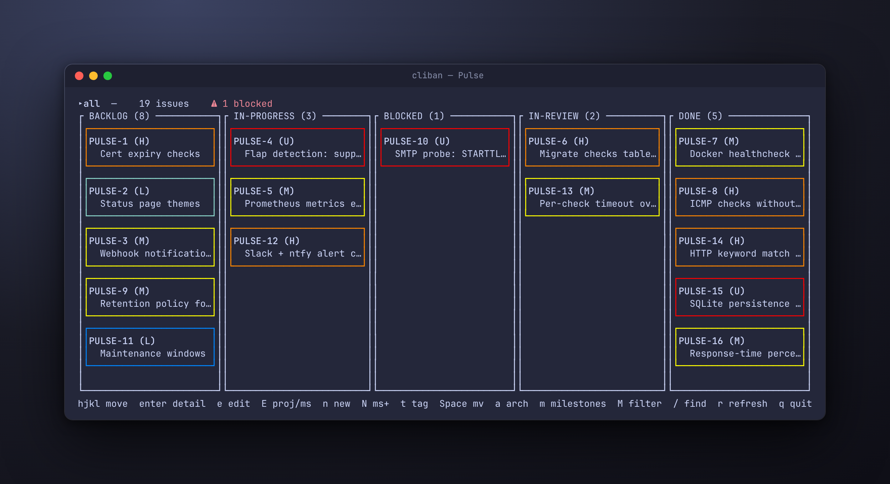
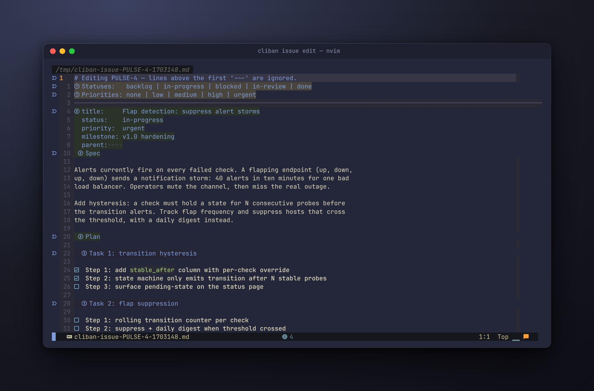
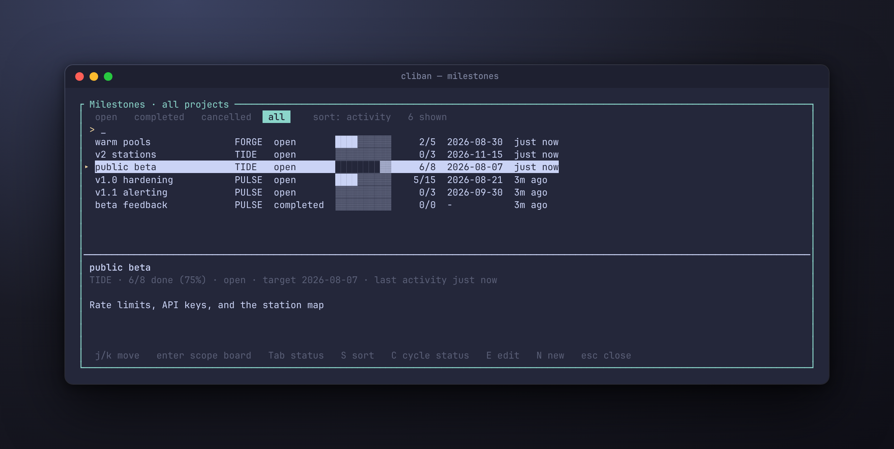

<p align="center"><b>The board your agents can't forget.</b></p>

<p align="center">
  <a href="https://github.com/LioraLabs/cliban/actions/workflows/ci.yml"></a>
  <a href="https://github.com/LioraLabs/cliban/releases/latest"></a>
  <a href="LICENSE"></a>
</p>

<p align="center"></p>

Your agent wrote a five-task plan, finished two tasks, compacted its context,
and greeted the next session with a cheerful blank stare? cliban is a
self-hosted kanban board built for exactly that agent. The spec and the plan
live in the issue, steps get ticked as they land, every mutation is recorded
on a timeline automatically, and durable lessons persist as searchable
project memory. All of it sits in SQLite behind atomic CLI commands, so the
plan outlives the context window that wrote it.

```console
$ cliban issue show PROJ-42 --section plan   # two steps ticked, three to go
$ # ...session crashes, /clear, compaction, lunch...
$ cliban issue current --json                # which issue is this branch again?
$ cliban activity --since 1d                 # what happened while nobody was looking
$ cliban issue tick PROJ-42 --task 2 --step 1   # and back to work
```

One board, three front doors:

- **A flat CLI** built for agents: every read has a `--json` form, no command
  opens an editor unless asked, and mutations are atomic and safe to run
  unattended.
- **A ratatui TUI** for you: priority-colored cards over five columns
  (`backlog / in-progress / blocked / in-review / done`).
- **`cliband`** for your team: an SSH daemon serving the same live board to
  everyone. `ssh boards.example.com` and you're in. SSH keys are the auth,
  one SQLite database per tenant is the isolation. See
  [Hosting shared boards](#hosting-shared-boards-over-ssh-cliband).

Heard enough?

```sh
cargo install --git https://github.com/LioraLabs/cliban cliban
```

Prebuilt binaries (static musl for Linux x86_64/aarch64, macOS Intel and
Apple Silicon, each archive carrying both `cliban` and `cliband`) are on the
[releases page](https://github.com/LioraLabs/cliban/releases).

## Why not ___?

**A markdown plan file?** Writing the plan to disk is the right instinct,
and it's how most agent-planning setups work: a `task_plan.md` and a
`progress.md`, re-read every turn. But a loose file has no structure a tool
can enforce. The agent can clobber the plan wholesale, two agents corrupt it
in parallel, and "how far did we get" is a diff, not a query. cliban makes
the plan a contract: tickable steps mutated through `tick`, `log`, and
`promote`, each one a single SQL transaction, each one refused loudly (exit
code 2) when the structure is violated. Nothing is ever deleted, archiving
is reversible, and the history survives every rewrite.

**Jira, Linear, GitHub Issues?** Built for humans clicking. Agents drive
them through rate-limited APIs with auth tokens, and your plans live on
someone else's server. cliban is a local SQLite file with a flat CLI:
nothing leaves your machine unless you run `cliband`, and then it goes only
where your SSH keys say.

**Your agent's own memory?** That's the thing that keeps getting compacted.

## Agents

The [Claude Code plugin](plugin/) ships the full workflow: the `cliban` CLI
skill, a convention layer for brainstorm, plan, execute, and finish, `/bugs`
and `/status` commands, ticket capture, and `complete-milestone`, an
orchestrator that runs every issue in a milestone through its own agent in
dependency order, each in an isolated git worktree.

```bash
claude plugin marketplace add LioraLabs/claude-plugins
claude plugin install cliban@lioralabs
```

Session recovery is the point. After a crash, `/clear`, or compaction, an
agent re-derives its entire working state from the board:

```bash
cliban issue current --json                   # the issue for this git branch
cliban issue show PROJ-42 --section plan      # ticked steps ARE the progress file
cliban activity --since 1d --json             # the timeline since yesterday
cliban project search PROJ "wal mode" --json  # durable lessons, fuzzy-searched
```

Other harnesses can use the same skill file directly:
[`plugin/skills/cliban/SKILL.md`](plugin/skills/cliban/SKILL.md) follows the
Agent Skills format and documents the complete command surface. A test keeps
it honest: name a command in the skill that the CLI doesn't have, and the
build fails.

## Workspace

- `cliban-core`: storage + domain layer (rusqlite; owns the schema and migrations).
- `cliban-tui`: the kanban board, priority-colored cards over cliban's five columns.
- `cliban`: the CLI binary. `cliban <subcommand>` for scripting, `cliban`
  (no args) or `cliban tui` for the board.
- `cliban-tenancy`: multi-tenant storage for the daemon, a `registry.db`
  (users, pubkeys, memberships, invites) routing to one cliban-core database
  per tenant under `tenants/<id>.db`.
- `cliban-server`: the `cliband` binary, a russh-based SSH daemon serving the
  TUI to authenticated clients with live cross-session updates.

## Quickstart

```bash
cliban project add PROJ --name "My project"
cliban issue add --project PROJ --title "First issue" --priority high
cliban             # opens the TUI
```

### Board keys

`hjkl` move the cursor · `H/L` move the focused issue across columns · `J/K` reorder it
within a column · `Enter` detail · `e` edit ($EDITOR) · `E` edit project/milestone ·
`n` new issue · `N` new milestone · `t` cycle milestone tag · `a` archive ·
`m` milestone page · `M` cycle milestone filter · `/` fuzzy find · `r` refresh ·
`?` help · `q` quit.

### Milestone page (`m`)

A full-screen view of every milestone (across all projects when the board is
unscoped), ordered by *recent activity*: the newest activity-log entry on any
of the milestone's issues. Shows done/total progress, target date, and a
detail pane for the focused row.

Type to filter by name or project key · `j/k` move · `Enter` scopes the board
to the milestone (and to its project) · `Tab` cycles the status bucket
(open / completed / cancelled / all) · `S` cycles the sort (activity / name /
target) · `C` cycles the focused milestone's own status · `E` edit ($EDITOR) ·
`N` new · `Esc` back to the board.

Cancelled is the archived state for a milestone: there is no separate archive
flag.

## Hosting shared boards over SSH (cliband)

`cliband` turns cliban into a hosted, multi-tenant kanban service with SSH as
the only transport: no browser, no TLS certificates, no reverse proxy. Auth is
SSH public keys; every tenant gets its own SQLite database, so isolation is
physical. Boards are live: a card moved in one session appears in every other
session on that tenant within a tick.

### Five-minute VPS setup

```bash
# on the server
cargo build --release -p cliban-server
sudo install -m755 target/release/cliband /usr/local/bin/cliband
sudo useradd --system --home /var/lib/cliband cliband
sudo mkdir -p /etc/cliband
sudo cp deploy/config.example.toml /etc/cliband/config.toml   # set signup_token!
sudo cp deploy/cliband.service /etc/systemd/system/
sudo systemctl enable --now cliband
```

First boot generates an ed25519 host key under the data dir. Point a DNS name
at the box, then from anywhere:

```bash
ssh -p 2222 boards.example.com signup myteam <signup-token>   # create a tenant
ssh -p 2222 boards.example.com                                # open the board
```

Teammates join with their own keys:

```bash
ssh -p 2222 boards.example.com invite          # you (owner): prints a one-time code
ssh -p 2222 boards.example.com accept <code>   # them: joins as member
```

Other control commands: `whoami`, `members`. A key with several tenants gets a
picker on connect. Running the daemon ad hoc (no systemd) also works:
`cliband --config config.toml`, or plain `cliband` for pure defaults.

### Configuration

All keys optional; defaults in parentheses. See `deploy/config.example.toml`.

| Key | Meaning |
|---|---|
| `listen_addr` | bind address for the SSH listener (`0.0.0.0:2222`) |
| `data_dir` | host key + registry.db + tenants/*.db (`$XDG_DATA_HOME/cliband`) |
| `signup_policy` | `open` \| `token` \| `closed` (`token`) |
| `signup_token` | shared token for `signup_policy = "token"` (unset means signup denied) |
| `max_tenants_per_key` | tenants one public key may create, 0 = unlimited (`5`) |
| `max_tenants` | global tenant cap, 0 = unlimited (`0`) |

Logs go to stderr, one fact per line: `journalctl -u cliband` shows them
stamped and indexed. Backup, export, or delete of a tenant is a file
operation on its `tenants/<id>.db`.

## Migrating from the Go cliban

The legacy Go build stored data in the same SQLite file under an older
schema. Convert it once:

```bash
cliban migrate-legacy --from /path/to/old/cliban.db --to /path/to/new/cliban.db
```

It opens the source read-only and writes a fresh `cliban-core` database,
preserving projects, milestones, issues, labels, relations, and
done-timestamps.

## Editor integration

By default `cliban issue add` and `cliban issue edit` never open an editor:
they fail fast if no content flags are supplied, which is the right behavior
for agents. Inside the TUI, select a card and press `e` for the frontmatter
+ markdown buffer in `$EDITOR` (`$VISUAL` first, falls back to `vi`):

<p align="center"></p>

## The description contract

Some cliban commands (`issue tick`, `issue promote`, `issue log`,
`issue show --section`) parse the markdown structure of an issue's
`description` field. They expect a small, well-defined contract.

### Top-level sections

Four H2 anchors are reserved and matched exactly:

- `## Spec`: the design/brainstorm output for this issue
- `## Plan`: the implementation plan
- `## Activity Log`: chronological events
- `## Notes`: long-lived notes (mostly for project-level descriptions)

Anything else in the description is preserved untouched.

### Plan tasks and steps

Within `## Plan`, tasks are numbered H3 headings:

```markdown
## Plan

### Task 1: short title

- [ ] **Step 1: ...**
- [ ] **Step 2: ...**

### Task 2: another short title

- [ ] **Step 1: ...**
```

Tasks are numbered (`### Task <N>:`), unique within the section. Steps are
GFM checkbox lines at column zero: `- [ ] ...` or `- [x] ...`. Indented
child bullets are not parsed as steps.

### Promotion suffix

A step that has been split into its own issue is suffixed with ` → KEY`:

```markdown
- [ ] **Step 3: CSRF middleware** → PROJ-18
```

Produced by `cliban issue promote`, consumed by readers: humans, and any
tooling that walks plans.

### Failure mode

If the structure is violated (missing `## Plan` anchor, renamed
`### Task N`, and so on), the workflow commands exit with code 2 and a clear
error naming the structural problem. No best-effort recovery: fix the
description and retry.

## Fuzzy-find tickets

Three coordinated surfaces share one matcher:

- `cliban issue ls --search QUERY`: pipeable. Adds a `score` field in
  `--json` output and respects every existing `ls` filter (`--project`,
  `--label`, `--milestone`, `--status`, `--priority`, `--archived`,
  `--no-subs`, `--parent`). `--limit N` caps results (default 50 when
  `--search` is set).
- `cliban fff [QUERY]`: prints the selected key to stdout so you can
  compose: `cliban issue show $(cliban fff)`. Same filter flags as `ls`.
  Batch NDJSON mode when stdin is not a TTY (great for `cliban fff foo | jq`).
- `/` inside `cliban tui`: fuzzy filter overlay; selecting a card snaps the
  board cursor onto it.

The matcher weights matches across title (×3.0), key (×2.5), labels (×2.0),
and description (×1.0). Default scope is all non-archived issues across all
projects; narrow with `--project`, `--label`, and friends.

## What changed recently

```bash
cliban activity                                   # last 24h, every project
cliban activity --since yesterday --json
cliban activity --since 3d --project PROJ --limit 200 --json
```

A merged, newest-first feed: `created` / `completed` when an issue opened or
finished in the window, `updated` for any other change neither of those
explains, `status` / `archive` for the transitions cliban recorded itself,
and one `log` event per `## Activity Log` line written in the window.
`--json` emits NDJSON of `ts`, `key`, `project`, `kind`, `issue_status`,
`title`, `message`, `actor`, `milestone` (`issue_status` is the issue's
status *now*, not at the time of the event).

### Recorded automatically

Every mutation writes to the issue's timeline without being asked: moves,
archives, field edits, label and relation changes, plan ticks, promotions,
and `issue log` notes. The history is complete even when nobody remembers to
narrate it:

```bash
export CLIBAN_ACTOR=claude                # attribute what you do
cliban issue mv PROJ-42 blocked --note "upstream fix needed"
cliban issue edit PROJ-42 --priority urgent --label regression
cliban issue show PROJ-42 --section activity
#   - 15:10Z — [claude] found it: positions collapse after ~50 reorders
#   - 15:12Z — [claude] in-progress → blocked: upstream fix needed
#   - 15:13Z — [claude] priority: high → urgent, +label regression
```

Nothing is ever deleted. A deleted row would take its timeline with it, so
`issue rm` and `project rm` archive, and `milestone rm` cancels. Each
reports what it really did and how to undo it:

```console
$ cliban issue rm PROJ-12
archived PROJ-12 — cliban archives instead of deleting (undo: cliban issue unarchive PROJ-12)
```

(`label rm` still deletes: a label is a tag, not a work item.)

Two sources feed that view: the entries cliban records
(`activity_log_entries`, attributed and durable) and the `## Activity Log`
markdown an author writes with `cliban issue log`. `issue log` writes both,
so a note survives a later `--description` rewrite that erases the markdown,
and the rewrite itself is recorded as `description rewritten, dropped ##
Activity Log`. Reads merge the two chronologically and de-duplicate, so
nothing appears twice.

`--since` (and `issue ls --updated-since`, which shares the same parser)
accepts a duration (`45s`, `90m`, `4h`, `3d`, `2w`), `today`, `yesterday`, a
bare date (`2026-07-25`), or a full RFC3339 timestamp. All UTC.

## Milestones

The TUI's milestone page (`m`) shows every milestone across projects,
ordered by recent activity, with progress and a detail pane:

<p align="center"></p>

From the CLI:

```bash
cliban milestone ls --project PROJ                     # name, status, target
cliban milestone ls                                    # every project
cliban milestone ls --sort activity --stats            # + done/total and recency
cliban milestone ls --status open --sort target        # what's due next
cliban milestone edit --project PROJ --name v0.1 --status completed
```

`--sort` takes `activity` (most recently worked on first), `name` (the
default) or `target` (soonest first, undated last). `--stats` adds a
`done/total` column and a last-activity column, and, with `--json`, the
`done_count`, `last_activity` and `last_activity_human` keys.

## Persistent agent memory

Durable agent context lives in the project's existing Markdown description,
under `## Notes`. Give each independently useful lesson its own `###`
heading so cliban can retrieve it without loading the whole section.

```bash
cliban project add PROJ --name "My project" --description-file project.md
cliban project show PROJ --section notes
cliban project search PROJ "sqlte canonical" --section notes --json
cliban project edit PROJ --description-file updated-project.md
# stdin works too:
cliban project edit PROJ --description-file - < updated-project.md
```

`project search` fuzzy-matches every whitespace-separated query term against
each `###` heading and body. It returns only matching subsections as NDJSON,
ranked by score and capped by `--limit` (default 20). Retrieval is
progressive: search first, load the full `## Notes` section only when
needed. `--section all` searches every `###` subsection in the description.

## Roadmap

**Loom**, a milestone orchestrator built on this store, is in development:
it snapshots a milestone, freezes a validated execution manifest (dependency
waves, roles, restart policies), and drives the whole thing to completion
restart-safely, with cliban remaining the source of truth for the work items
themselves. The `complete-milestone` skill in the plugin is the manual
version of that loop today.

## A note on stability

cliban is pre-1.0 software. The skill file documents the CLI as it actually
is: a test walks every command the skill names and fails the build when the
two disagree. If the README and the CLI disagree, the README has a bug.

## Test

```bash
cargo test --workspace
```
